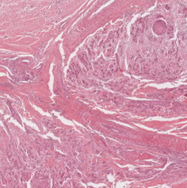
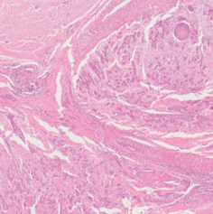
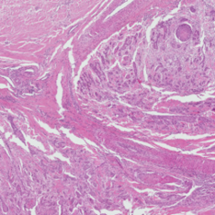
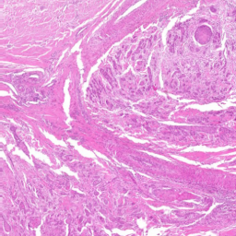
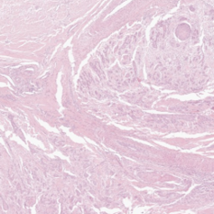

# Multi-Scanner Squamous Cell Carcinoma Dataset

This repository contains code examples for the experiments presented in:

> F. Wilm, M. Fragoso, C. Bertram, N. Stathonikos, M. Öttl, J. Qiu, R. Klopfleisch, A. Maier, K. Breininger, and 
M. Aubreville "Multi-Scanner Canine Cutaneous Squamous Cell Carcinoma Histopathology Dataset" (2023).
[arXiv:2301.04423v2](https://doi.org/10.48550/arXiv.2301.04423) 

The manuscript presents a publicly available multi-scanner dataset on microscopic whole slide images (WSIs) of canine 
cutaneous squamous cell carcinoma (SCC). The dataset can be downloaded on 
[Zenodo](https://www.doi.org/10.5281/zenodo.7418554). The dataset consists of 44 samples digitized with five slide 
scanning systems:

  
  
  
  
  

  
